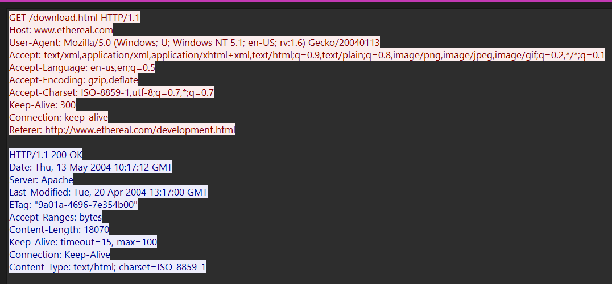
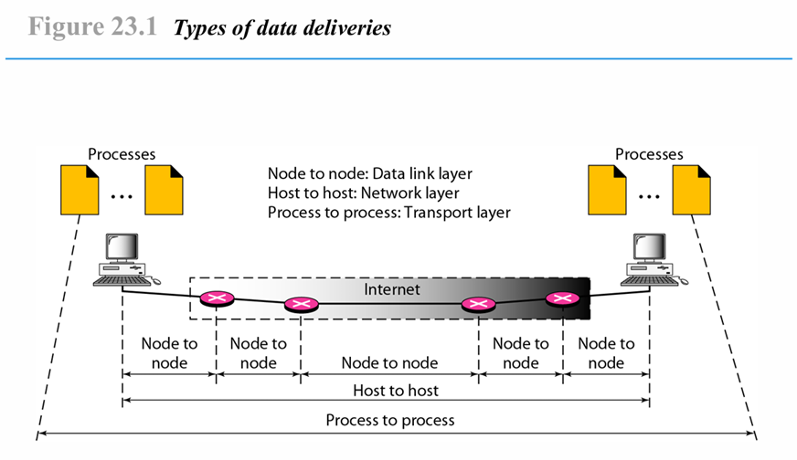
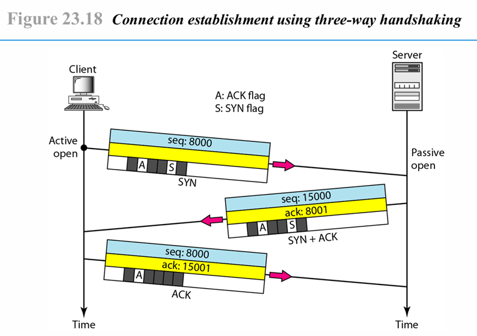

  <h1 style="text-align: center;font-weight: bold">Laporan Week 1 ADMINISTRASI JARINGAN</h1>

 

  
  <h4 style="text-align: center;">Dosen Pengampu : Dr. Ferry Astika Saputra, S.T., M.Sc.</h4>
  <h3 style="text-align: center;">Disusun Oleh : </h3>
  

    <strong>Nama : Dio Ramadhan Widya Pamungkas</strong> 
    <strong>Kelas : 2 D3 IT A</strong> 
    <strong>NRP : 3123500011</strong>
  

<h3 style="text-align: center;line-height: 1.5">Politeknik Elektronika Negeri Surabaya Departemen Teknik Informatika Dan Komputer Program Studi Teknik Informatika 2024/2025</h3>
  

## LAPORAN WORKSHOP 1: WIRESHARK ANALYSIS

### 1.	Analisa file http.cap dengan wireshark : Versi HTTP yang digunakan, IP address dari client maupun server, waktu dari client mengirimkan HTTP request., Waktu dari server mengirinmkan server dan berapa durasinya.

Jawaban :

Versi HTTP yang digunakan adalah 1.1.

IP address client 145.254.160.237 dan server 65.208.228.223.

Client mengirimkan HTTP request pada waktu 0.911310.

Server memberikan respons pada 3.955688, waktu yang dibutuhkan sejak request dikirim hingga respons diterima adalah 3.044378 detik.

### 2. Deskripsi gambar pada slide.

Jawaban :

**Process to Process – Transport Layer**  
Lapisan ini memungkinkan aplikasi di satu perangkat berkomunikasi langsung dengan aplikasi di perangkat lain. Di sini, data dikirim dengan memastikan keandalan dan urutan yang benar menggunakan protokol seperti TCP atau UDP.  

**Host to Host – Network Layer**  
Lapisan ini bertugas mengirimkan data dari satu perangkat ke perangkat lain dalam jaringan. Ia menangani pengalamatan serta menentukan jalur terbaik agar data sampai ke tujuan menggunakan protokol seperti IP.  

**Node to Node – Data Link Layer**  
Lapisan ini mengatur komunikasi antara perangkat jaringan seperti switch atau router dalam satu segmen jaringan. Prosesnya mencakup pengiriman data yang stabil menggunakan protokol seperti Ethernet atau Wi-Fi.
### 3. Rangkuman tahapan komunikasi menggunakan TCP.

Jawaban :

Three-way handshake adalah proses yang digunakan TCP untuk membangun koneksi antara klien dan server dalam tiga tahap. Pertama, klien mengirimkan paket SYN ke server dengan nomor urut awal (misalnya seq: 8000) sebagai permintaan koneksi. Kedua, server merespons dengan SYN-ACK, mengirimkan nomor urutnya sendiri (misalnya seq: 15000) dan mengakui nomor urut klien dengan ack: 8001. Ketiga, klien membalas dengan ACK, mengirimkan ack: 15001, yang berarti koneksi telah berhasil dibuat. Proses ini memastikan kedua perangkat telah sinkron sebelum mulai bertukar data.

Setelah koneksi terbentuk, klien mulai mengirimkan data. Segmen pertama dikirim dengan seq: 8001 dan ack: 15001, membawa data dari byte 8001–9000. Lalu, segmen berikutnya dikirim dengan seq: 9001 dan ack: 15001, membawa data dari byte 9001–10000. Setelah menerima dua segmen ini, server mengirimkan data balasan dengan seq: 15001, ack: 10001, berisi data dari byte 15001–17000. Terakhir, klien mengonfirmasi penerimaan dengan mengirimkan segmen seq: 10000, ack: 17001, serta menyertakan rwnd: 10000, yang menunjukkan seberapa banyak data tambahan yang bisa diterima. Mekanisme ini memastikan data dikirim dengan urutan yang benar dan diterima tanpa kesalahan.
Saat salah satu pihak ingin mengakhiri koneksi (aktif close), misalnya klien, ia mengirim segmen dengan FIN flag, seq: x, dan ack: y, menandakan bahwa tidak ada lagi data yang akan dikirim. Server, sebagai pihak yang melakukan passive close, membalas dengan segmen berisi FIN + ACK flag, dengan seq: y dan ack: x + 1, sebagai tanda setuju untuk menutup koneksi. Terakhir, klien mengirimkan ACK dengan seq: x dan ack: y + 1, menandakan koneksi telah benar-benar ditutup, dan kedua perangkat bisa mengosongkan sumber daya yang digunakan.

## KESIMPULAN
Praktikum ini mencakup peninjauan kembali materi tentang OSI Layer, analisis jaringan dengan Wireshark, serta proses komunikasi menggunakan TCP. Selain itu, dilakukan praktik analisis paket data menggunakan Wireshark untuk memahami lebih dalam cara kerja jaringan.
