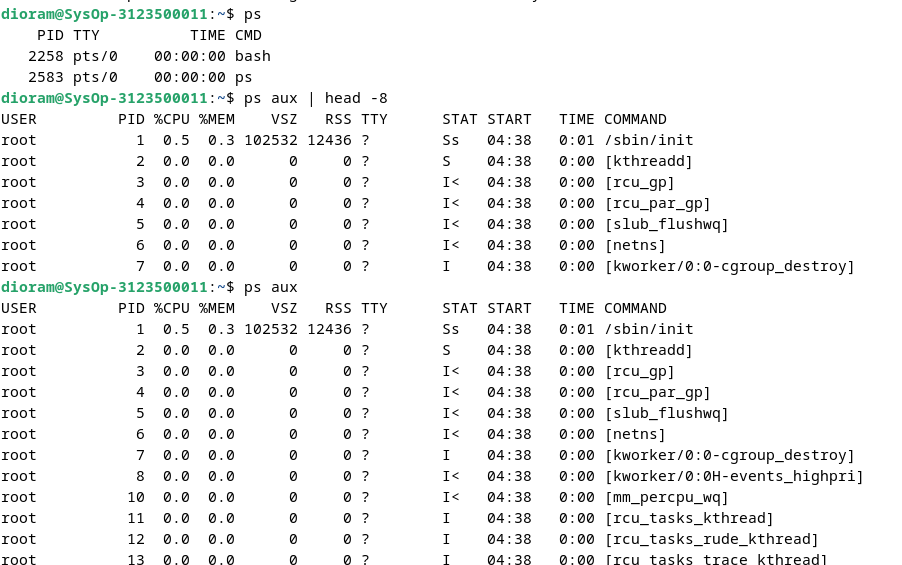
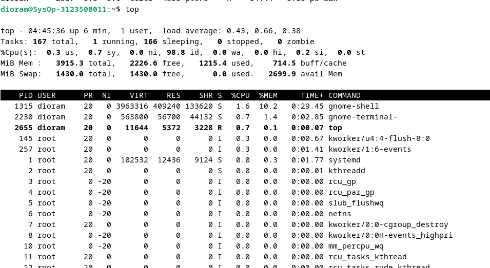
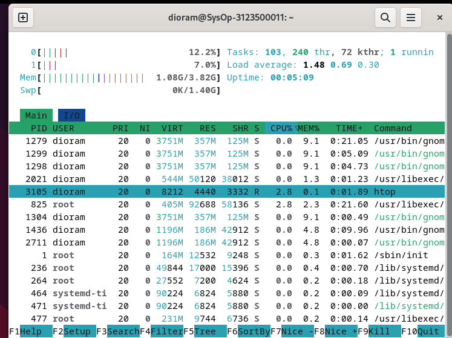
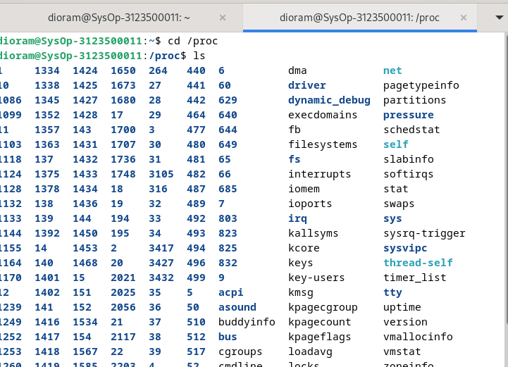
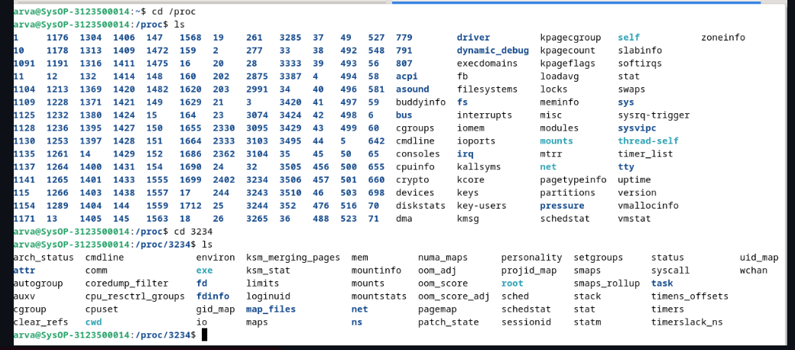
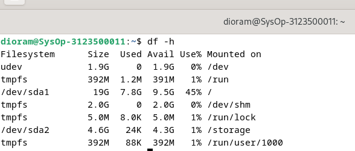
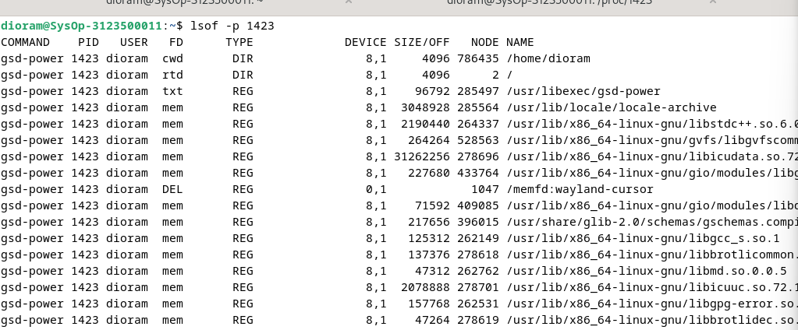

<div align="center">
  <h1 style="text-align: center;font-weight: bold">Laporan Week 2<br>ADMINISTRASI JARINGAN</h1>
</div>
<br />
<div align="center">
  
  <h4 style="text-align: center;">Dosen Pengampu : Dr. Ferry Astika Saputra, S.T., M.Sc.</h4>
  <h3 style="text-align: center;">Disusun Oleh : </h3>
  <p style="text-align: center;">
    <strong>Nama : Dio Ramadhan Widya Pamungkas</strong><br>
    <strong>Kelas : 2 D3 IT A</strong><br>
    <strong>NRP : 3123500011</strong>
  </p>

<h3 style="text-align: center;line-height: 1.5">Politeknik Elektronika Negeri Surabaya<br>Departemen Teknik Informatika Dan Komputer<br>Program Studi Teknik Informatika<br>2024/2025</h3>
  <hr><hr>
</div>

### BAB 4
#### Komponen dari sebuah proses
Sebuah proses terdiri dari ruang alamat dan kumpulan sturktur data yang berada pada dalam kernel.

Berikut adalah hasil parafrase dalam format markdown:  

### Ruang Alamat dan Thread pada Proses  

Ruang alamat adalah sekumpulan halaman memori yang telah dialokasikan oleh kernel untuk digunakan oleh suatu proses. Halaman memori ini berfungsi sebagai unit pengelolaan memori yang menyimpan kode program, data, serta tumpukan proses. Kernel mencatat informasi terkait proses, seperti status, prioritas, parameter penjadwalan, dan informasi lainnya dalam struktur data.  

Informasi yang dicatat oleh kernel untuk setiap proses meliputi:  

- Pemetaan ruang alamat proses  
- Status proses saat ini, seperti *Running*, *Sleeping*, dan lainnya  
- Prioritas proses  
- Sumber daya yang digunakan, seperti CPU dan memori  
- Informasi mengenai file dan port jaringan yang terbuka  
- Masker sinyal, yaitu kumpulan sinyal yang saat ini diblokir  
- Identitas pemilik proses  

Thread adalah konteks eksekusi di dalam suatu proses. Setiap proses dapat memiliki lebih dari satu thread yang berbagi ruang alamat dan sumber daya yang sama. Thread digunakan untuk mendukung eksekusi paralel dalam proses, memungkinkan beberapa tugas berjalan secara bersamaan. Thread dikenal sebagai proses ringan (*lightweight process*) karena lebih mudah dibuat dan dihancurkan dibandingkan proses penuh.  

### Identifikasi Proses  

#### **PID: Process ID**  
Setiap proses memiliki Process ID (PID) yang bersifat unik. PID adalah angka integer yang diberikan oleh kernel saat proses dibuat. PID ini digunakan untuk mengidentifikasi dan merujuk suatu proses dalam berbagai pemanggilan sistem.  

#### **PPID: Parent Process ID**  
Setiap proses memiliki Parent Process ID (PPID), yang menunjukkan proses induk atau proses yang membuatnya. PPID adalah PID dari proses yang bertindak sebagai orang tua dari proses tersebut. Informasi ini berguna dalam pemanggilan sistem untuk mengelola hubungan antara proses induk dan anak.  

#### **UID dan EUID: User ID dan Effective User ID**  
- **User ID (UID)** adalah identitas numerik pengguna yang menjalankan suatu proses.  
- **Effective User ID (EUID)** adalah UID yang digunakan oleh proses untuk menentukan hak akses terhadap sumber daya sistem seperti file dan port jaringan.  

### **Siklus Hidup Proses**  
Proses baru dibuat menggunakan pemanggilan sistem `fork()`, yang membuat salinan dari proses yang telah ada. Proses baru ini sebagian besar identik dengan induknya, tetapi memiliki PID yang berbeda dan menjalankan eksekusi secara independen.  

Saat sistem melakukan booting, kernel secara otomatis menciptakan beberapa proses, termasuk init atau systemd, yang memiliki PID 1. Proses ini bertanggung jawab untuk menjalankan skrip startup sistem dan mengelola layanan lainnya.  

### **Signals: Notifikasi untuk Proses**  
Signal adalah mekanisme yang digunakan untuk mengirim notifikasi ke suatu proses. Ada lebih dari 30 jenis sinyal yang didefinisikan dan digunakan dalam berbagai skenario, seperti:  
- Komunikasi antar proses  
- Penghentian, interupsi, atau penangguhan proses saat tombol tertentu ditekan  
- Instruksi dari administrator menggunakan perintah `kill`  
- Pemberitahuan dari kernel ketika suatu proses mengalami kesalahan fatal  
- Notifikasi dari kernel terkait kondisi khusus pada suatu proses  

### **Perintah `kill`: Mengirim Sinyal ke Proses**  
Perintah `kill` digunakan untuk mengirim sinyal ke suatu proses, umumnya untuk menghentikan eksekusi proses tersebut. Secara default, `kill` mengirimkan **sinyal TERM**, yang meminta proses untuk menghentikan dirinya sendiri dengan cara yang aman. Namun, proses dapat menangkap, memblokir, atau mengabaikan sinyal TERM.  

Jika proses tidak merespons, perintah **`kill -9`** atau **`kill -KILL`** dapat digunakan untuk mengirim **sinyal KILL**, yang tidak bisa ditangkap, diblokir, atau diabaikan oleh proses.  

#### **Sintaks Perintah `kill`**  
```
kill [-signal] pid
```
Contoh percobaan : <br>


#### ps: Pemantauan Proses
Perintah ps adalah alats utama milik system administrator untuk memantau proses. Perintah ini dapat menunjukkan PID, UID, prioritas, dan terminal kontrol dari proses. ps juga memberi informasi seberapa banyak pemakaian memori dari proses, seberapa banyak waktu CPU telah dipakai, dan kondisi proses-proses sekarang.
syntax perintah ps

Contoh percobaan : <br>


### **top: Pemantauan Sistem Secara Interaktif**  

Perintah `top` digunakan untuk memantau aktivitas sistem secara real-time dengan tampilan yang diperbarui secara dinamis. Perintah ini menampilkan ringkasan sistem serta daftar proses atau thread yang sedang berjalan dan dikelola oleh kernel Linux.  

Pengguna dapat menyesuaikan tampilan informasi yang ditampilkan, seperti jenis data, urutan, dan ukuran proses. Pengaturan yang telah dikonfigurasi dapat disimpan sehingga tetap berlaku meskipun sistem telah di-restart.  

Secara default, tampilan `top` akan diperbarui setiap 1-2 detik, bergantung pada konfigurasi sistem.  

Contoh percobaan : <br>


Selain top, ada juga perintah htop, yang merupakan pemantau proses interaktif untuk sistem Unix. htop adalah aplikasi berbasis teks (untuk konsol atau terminal X) dan memerlukan library ncurses. Perintah ini mirip dengan top, tetapi memungkinkan pengguna untuk menggulir layar secara vertikal dan horizontal, sehingga semua proses yang berjalan di sistem beserta perintah lengkapnya dapat dilihat

Contoh Percobaan : <br>


### **`nice` dan `renice`: Mengubah Prioritas Proses**  

Niceness adalah nilai numerik yang digunakan untuk memberi petunjuk kepada kernel mengenai tingkat prioritas suatu proses dibandingkan dengan proses lain yang juga memerlukan waktu CPU.  

- Proses dengan prioritas rendah dianggap kurang penting dan akan mendapatkan waktu CPU lebih sedikit.  
- Proses dengan prioritas tinggi dianggap lebih penting dan akan mendapatkan lebih banyak alokasi CPU.  

Niceness bekerja dengan konsep berikut:  
- Nilai niceness tinggi berarti prioritas proses lebih rendah, karena Anda "bersikap baik" dengan memberikan kesempatan lebih besar kepada proses lain.  
- Nilai niceness rendah atau negatif berarti prioritas lebih tinggi, karena proses Anda akan lebih diutamakan oleh sistem.  

Rentang nilai niceness berbeda tergantung sistem operasi:  
- Linux: -20 hingga +19  
- FreeBSD: -20 hingga +20  

### **`nice`: Menjalankan Proses dengan Prioritas Tertentu**  
Perintah `nice` digunakan untuk memulai suatu proses dengan nilai niceness yang telah ditentukan.  

#### **Sintaks Perintah `nice`**  
```
nice -n <nilai_niceness> <perintah>
```

### **`/proc` Filesystem**  

Direktori `/proc` adalah pseudo-filesystem dalam Linux yang digunakan oleh kernel untuk menyediakan berbagai informasi mengenai status sistem. Direktori ini berisi data tentang proses yang sedang berjalan, serta statistik sistem dan informasi lainnya.  

Meskipun namanya `/proc`, isi dari direktori ini tidak terbatas pada informasi proses saja, tetapi juga mencakup berbagai parameter sistem yang dapat diakses secara dinamis.  

Contoh : <br> 
 <br>


#### Strace dan Struss
Perintah strace (Linux) dan truss (FreeBSD) digunakan untuk melacak system calls (panggilan sistem) dan signals (sinyal) yang dilakukan oleh suatu proses. Alat ini berguna untuk melakukan debugging program atau memahami apa yang sedang dilakukan oleh suatu program.

### **Runaway Process: Proses yang Tidak Terkendali**  

**Runaway Process** adalah proses yang berhenti merespons sistem dan berjalan tanpa kendali. Proses ini mengabaikan prioritas penjadwalannya dan terus menggunakan **100% CPU**, menyebabkan sistem menjadi sangat lambat karena proses lain hanya mendapatkan akses terbatas ke CPU.  

### **Mengatasi Runaway Process**  
- Menghentikan proses: Gunakan perintah `kill` untuk mengakhiri runaway process.  
- Menyelidiki proses:  
  - Linux: Gunakan perintah `strace` untuk menganalisis aktivitas proses.  
  - FreeBSD: Gunakan perintah `truss` untuk memantau eksekusi sistem proses.  
- Memeriksa penggunaan filesystem: Gunakan perintah `df` untuk melihat kapasitas dan pemakaian ruang penyimpanan pada sistem.  

Contoh : <br>


Untuk melihat proses yang dibuka oleh runaway process menggunakan perintah lsof.



### **Proses Periodik**  

**Proses periodik** adalah tugas yang dieksekusi secara otomatis pada waktu yang telah dijadwalkan. Di sistem operasi Linux, perintah terjadwal dapat dijalankan menggunakan **cron** (atau `crond` di RedHat) serta **systemd timer**, yang menawarkan alternatif lebih fleksibel dan kuat.  

### **Cron: Menjadwalkan Perintah**  
Cron adalah daemon yang berjalan sejak sistem dinyalakan dan tetap aktif selama sistem beroperasi. Daemon ini membaca file konfigurasi yang disebut crontab (cron table), yang berisi daftar perintah beserta jadwal eksekusinya.  

Crontab menjalankan perintah melalui shell (`sh`), sehingga hampir semua perintah yang dapat dieksekusi secara manual melalui shell juga dapat dijadwalkan menggunakan cron.  

### **Format Crontab:**  
```
*     *     *     *     *  command_to_execute
-     -     -     -     -
|     |     |     |     |
|     |     |     |     +----- Hari dalam minggu (0-6, 0=Minggu)
|     |     |     +------- Bulan (1-12)
|     |     +--------- Tanggal (1-31)
|     +----------- Jam (0-23)
+------------- Menit (0-59)
```

Contoh penggunaan crontab<br>
Menjalankan perintah setiap hari pukul 2:30 pagi:
```
30 2 * * * command
```
Menjalankan skrip Python setiap tanggal 1 pukul 2:30 pagi:
```bash
30 2 1 * * /usr/bin/python3 /path/to/script.py
```
Menjalankan perintah setiap 30 menit:
```bash
*/30 * * * * command
```

- Systemd Timer: Alternatif Modern untuk Cron<br>
Systemd timer adalah file konfigurasi unit systemd yang berekstensi `.timer`. Timer ini lebih fleksibel dan powerful dibanding cron, karena dapat diaktifkan berdasarkan waktu, boot sistem, atau event tertentu diaktifkan oleh service unit yang sesuai, dan dapat dikelola menggunakan perintah `systemctl`.<br>
Contoh Systemd Timer:<br>
```bash
systemctl list-timers
```

Contoh file timer (logrotate.timer):<br>
```
[Unit]
Description=Daily rotation of log files

[Timer]
OnCalendar=daily
AccuracySec=1h
Persistent=true

[Install]
WantedBy=timers.target
```
- Kegunaan Umum Tugas Terjadwal:<br>
  - Mengirim Email: Mengirim laporan atau hasil perintah secara otomatis melalui email.<br>
  - Membersihkan Filesystem: Menjalankan skrip untuk menghapus file lama, seperti membersihkan direktori sampah setiap hari.<br>
  - Rotasi Log File: Membagi file log menjadi beberapa segmen berdasarkan ukuran atau tanggal, dan menyimpan versi lama.<br>
  - Menjalankan Batch Jobs: Menjalankan tugas panjang seperti pemrosesan pesan antrian atau ETL (Extract, Transform, Load) ke data warehouse.<br>
  - Backup dan Mirroring: Menjadwalkan backup otomatis ke sistem remote atau membuat mirror (salinan byte-per-byte) menggunakan rsync.<br>
