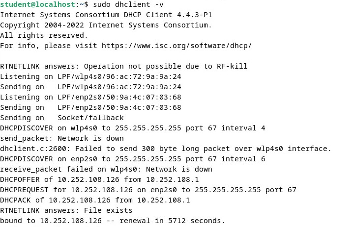
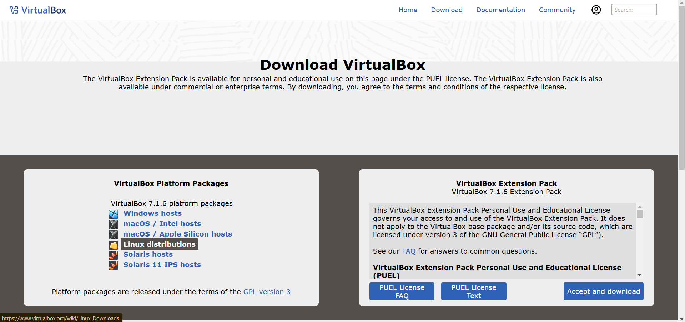
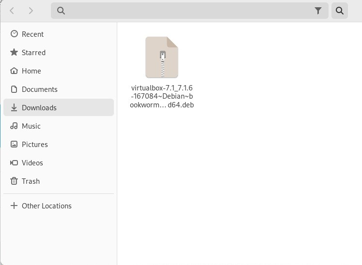
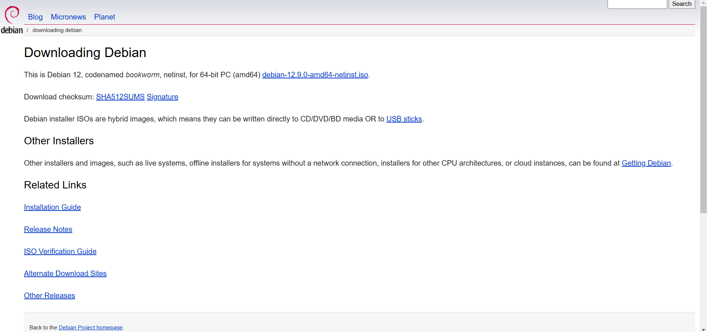
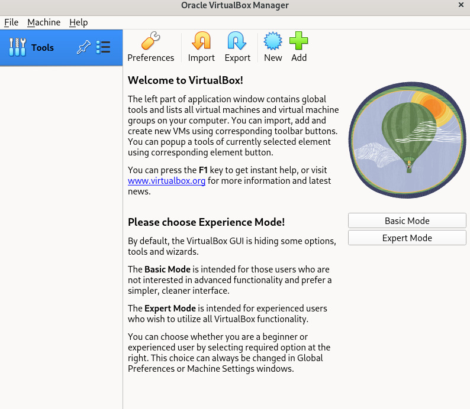
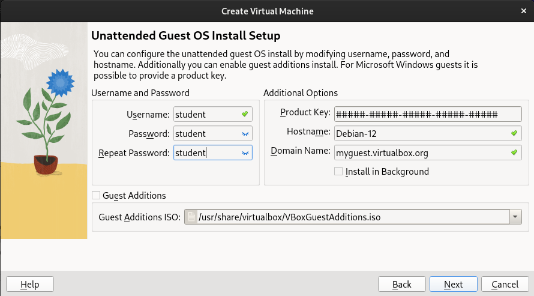
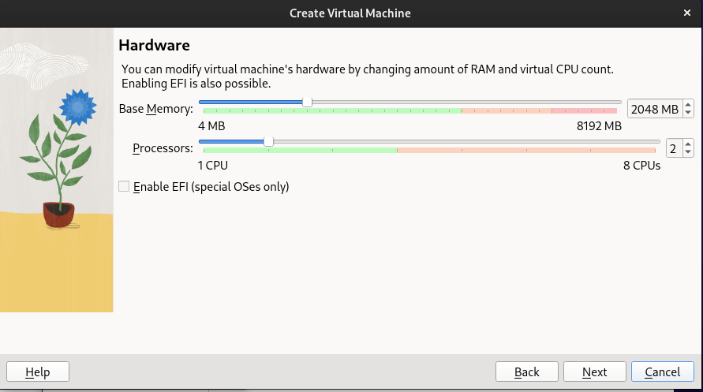
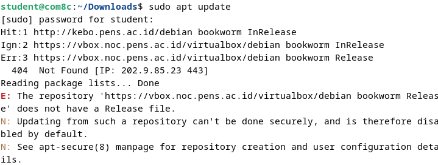
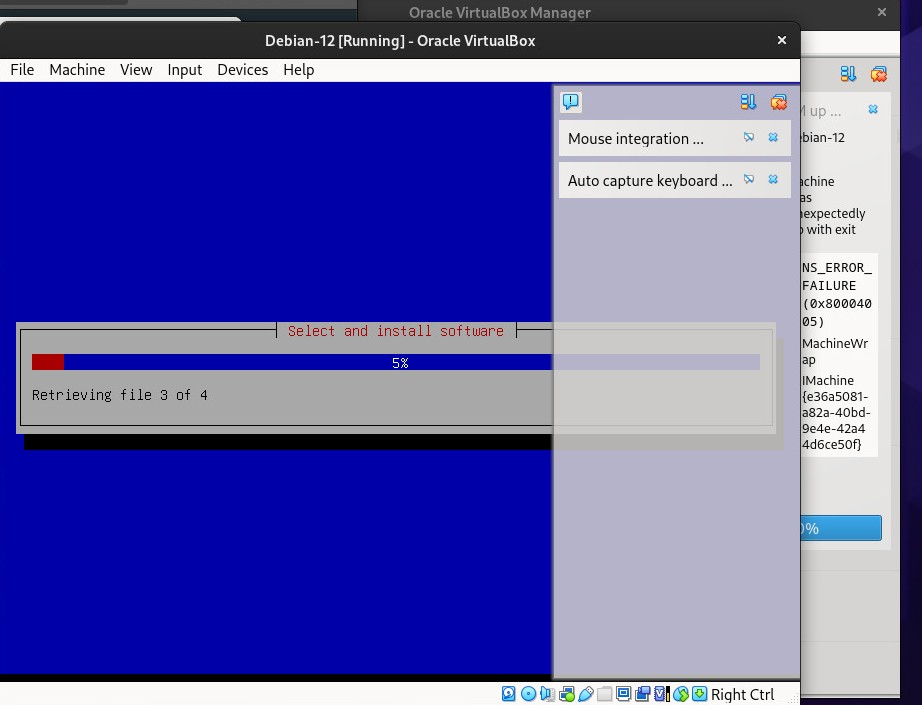
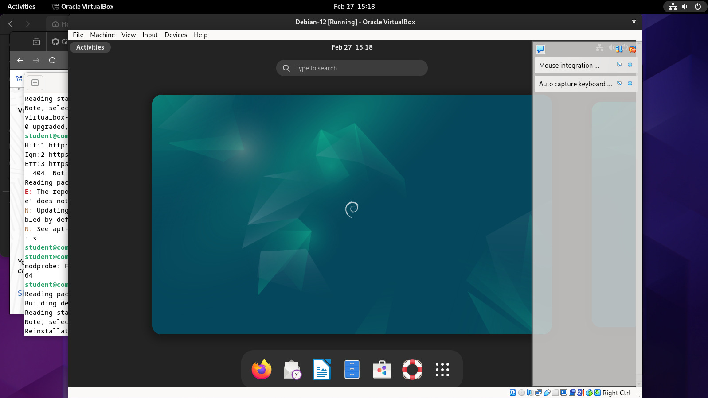

  <h1 style="text-align: center;font-weight: bold">Laporan Week 2 ADMINISTRASI JARINGAN</h1>

 

  
  <h4 style="text-align: center;">Dosen Pengampu : Dr. Ferry Astika Saputra, S.T., M.Sc.</h4>
  <h3 style="text-align: center;">Disusun Oleh : </h3>
  

    <strong>Nama : Dio Ramadhan Widya Pamungkas</strong> 
    <strong>Kelas : 2 D3 IT A</strong> 
    <strong>NRP : 3123500011</strong>
  

<h3 style="text-align: center;line-height: 1.5">Politeknik Elektronika Negeri Surabaya Departemen Teknik Informatika Dan Komputer Program Studi Teknik Informatika 2024/2025</h3>
  

## Daftar Isi

1. [Instalasi Debian Linux Pada VirtualBox](#instalasi-debian)
2. [Kesimpulan](#kesimpulan)

## Instalasi Debian Linux di VirtualBox melalui terminal root pada OS Linux

#### Solve LAN Wired Not Connected

Perintah `sudo dhclient -v` digunakan untuk memperbarui konfigurasi jaringan secara dinamis melalui DHCP dan menampilkan output secara detail.

#### Install Git dan Clone Github

(img/install-git.png)

Command `sudo apt install git` digunakan untuk menginstall git pada komputer lab.

Kemudian clone menggunakan git clone dengan cara copy paste link github dibawah ini:

<pre><code>https://github.com/ferryastika/unix-and-linux-sysadmin-notes.git</code></pre>

#### Download VirtualBox Linux

Klik pada bagian Linux distributions.

Kemudian pilih Debian 12, lalu klik untuk mendownload.

Setelah proses unduhan selesai, file VirtualBox akan tersimpan di folder Downloads.

#### Download ISO Debian 12

ISO yang akan digunakan dalam VirtualBox.

#### Proses Instalasi VirtualBox

Di folder Downloads, klik kanan pada file VirtualBox, lalu pilih Open Terminal. Kemudian, jalankan perintah berikut untuk memulai instalasi VirtualBox.

Dari capture diatas terdapat error yang terjadi karena dependensi yang dibutuhkan oleh VirtualBox belum terinstal, khususnya `libxcb-cursor0`. Saat menggunakan `dpkg -i`, hanya paket yang dipilih yang diinstal tanpa secara otomatis menyelesaikan dependensi yang hilang. Karena `libxcb-cursor0` tidak ditemukan di sistem, proses instalasi VirtualBox gagal dengan status "dependency problems".

Untuk mengatasi permasalahan diatas, dapat dijalankan dengan perintah berikut:

Perintah `sudo apt install -f` akan menginstal semua dependensi yang hilang dan memperbaiki konfigurasi yang belum selesai, sehingga VirtualBox dapat terinstal dengan benar.

#### Menjalankan Virtual Machine

Error `Can't enumerate USB devices` di VirtualBox terjadi karena sistem gagal mengenali USB, biasanya akibat dukungan USB belum aktif, kurangnya izin user, atau Extension Pack belum terinstal. Masalah ini sering terjadi di Linux jika user belum masuk grup `vboxusers`. 

Jika menggunakan Linux, user perlu memiliki izin untuk mengakses perangkat USB di VirtualBox. Maka jalankan perintah `sudo usermod -aG vboxusers $USER` di terminal, lalu restart sistem agar perubahan diterapkan.

#### Menjalankan New Virtual Machine

Jika tampilan sudah sesuai seperti dibawah ini, maka proses akan dilanjutkan ke langkah berikutnya.

#### Langkah - Langkah

Sesuaikan nama dan OS seperti pada gambar di atas. Jika file ISO Debian 12 sudah diunduh, masukkan lokasinya pada kolom ISO Image.

Melakukan setting username dan password dengan menggunakan nama `student`.

Setup RAM menjadi 2 GB dan menggunakan 2 CPU untuk prosesor.

Mengalokasikan 10 GB ruang penyimpanan pada HDD (Hard Disk Drive).

Jika spesifikasi sudah sesuai, klik Finish untuk melanjutkan proses instalasi.

#### Error Pada Kernel

Setelah mengklik Finish, muncul pop-up error seperti yang ditampilkan di bawah ini.

Error `Kernel driver not installed (rc=-1908)` terjadi karena VirtualBox tidak dapat menemukan atau memuat driver kernel (vboxdrv) yang diperlukan. Penyebabnya bisa karena Secure Boot masih aktif, modul kernel belum terinstal, atau VirtualBox perlu dikonfigurasi ulang setelah pembaruan sistem.

Untuk mengatasi masalah diatas, jalankan perintah berikut guna memuat ulang driver kernel.

#### Proses Instalasi Debian Berjalan

Jalankan dan tunggu hingga Debian pada VM terinstal dan terinisialisasi dengan benar.

Jika tampilan sudah seperti dibawah ini, maka instalasi Debian 12 di VirtualBox telah berhasil.

## Kesimpulan

Kesimpulannya, error pada VirtualBox, seperti `Kernel driver not installed (rc=-1908)` dan `Can't enumerate USB devices`, umumnya disebabkan oleh konfigurasi yang belum lengkap, izin yang kurang, atau modul yang belum terinstal. Untuk mengatasinya yaitu meliputi menambahkan user ke grup `vboxusers`, serta menginstal dan mengonfigurasi ulang driver kernel. Jika menjalankan Debian 12 di VirtualBox, user harus mendownload ISO dan sistem dikonfigurasi dengan benar agar dapat berjalan tanpa ada problem.
