<div align="center">
  <h1 class="text-align: center;font-weight: bold">Praktikum <br>Workshop Administrasi Jaringan Week 4</h1>
  <h3 class="text-align: center;">Dosen Pengampu : Dr. Ferry Astika Saputra, S.T., M.Sc.</h3>
</div>
<br />
<div align="center">
  
  <h3 style="text-align: center;">Disusun Oleh : </h3>
  <p style="text-align: center;">
    <strong>Dio Ramadhan W.P (3123500011)</strong><br>
  </p>

<h3 style="text-align: center;line-height: 1.5">Politeknik Elektronika Negeri Surabaya<br>Departemen Teknik Informatika Dan Komputer<br>Program Studi Teknik Informatika<br>2025/2026</h3>
  <hr><hr>
</div>

# Sistem Nama Domain (DNS)

## **Apa itu DNS?**
DNS (Domain Name System) adalah punya prinsip yang sama dengan buku kuning telepon pada zaman dahulu. Bedanya, sekarang perangkat mencari nama domain di DNS untuk mendapatkan alamat IP. Bedanya, DNS bekerja secara otomatis dan sangat cepat, tanpa perlu dicari secara manual seperti buku kuning dulu.Manusia mengakses informasi online menggunakan **nama domain** (contoh: `nytimes.com` atau `espn.com`). Namun, peramban web berkomunikasi menggunakan **alamat IP**. DNS menerjemahkan nama domain menjadi alamat IP agar peramban dapat memuat sumber daya Internet. Setiap perangkat yang terhubung ke Internet memiliki **alamat IP unik**, yang digunakan oleh mesin lain untuk menemukannya. DNS memungkinkan pengguna **tidak perlu menghafal alamat IP**, seperti `192.168.1.1` (IPv4) atau `2400:cb00:2048:1::c629:d7a2` (IPv6).

---

## Bagaimana DNS Bekerja?

Proses resolusi DNS** mengubah hostname (contoh: `www.example.com`) menjadi alamat IP (`192.168.1.1`). Ini seperti mencocokkan alamat rumah dengan nama pemiliknya. Saat pengguna mengakses sebuah situs web, terjadi proses pencarian alamat IP dari nama domain yang dimasukkan.
Pencarian DNS terjadi "di balik layar" dan melibatkan beberapa **komponen utama** dalam sistem DNS.
Gampangnya, nanti klien akan memasukkan domain yang ingin dikunjungi. DNS akan meemberikan IP dari domain tersebut sehingga klien bisa memulai komunikasi dengan server yang dituju.
---

## **Komponen Utama dalam DNS**

### 1. **DNS Recursor**
- Berperan seperti **pustakawan** yang mencari buku dalam perpustakaan.
- Bertugas menerima permintaan dari klien (misalnya, peramban web).
- Melakukan permintaan tambahan untuk mendapatkan alamat IP yang dicari.

### 2. **Root Nameserver**
- Langkah pertama dalam menerjemahkan nama domain ke alamat IP.
- Berfungsi seperti **indeks perpustakaan**, yang mengarahkan pencarian ke bagian lebih spesifik.

### 3. **TLD Nameserver (Top-Level Domain)**
- Bertanggung jawab atas ekstensi domain tertentu, misalnya:
  - `.com`, `.org`, `.net` (domain umum)
  - `.id`, `.jp`, `.uk` (domain berdasarkan negara)
- Berfungsi seperti **rak buku** yang hanya berisi kategori tertentu.

### 4. **Authoritative Nameserver**
- Langkah terakhir dalam pencarian DNS.
- Bisa dianggap seperti **kamus**, yang memberikan definisi atau informasi final.
- Jika memiliki catatan DNS yang dicari, server ini akan mengembalikan alamat IP ke **DNS Recursor**.

---

# Fitur DNS

DNS memiliki beberapa fitur, di antaranya:

- **Globally distributed**  
  DNS terdiri dari banyak server yang dikelola oleh berbagai operator di seluruh dunia, memastikan ketersediaan dan kecepatan akses.

- **Loosely coherent**  
  Meskipun terdistribusi, semua server tetap menjadi bagian dari satu sistem DNS global yang bekerja secara bersamaan.

- **Scalable**  
  Sistem ini dapat ditingkatkan dengan menambahkan lebih banyak server untuk menangani peningkatan jumlah permintaan pengguna.

- **Handal**  
  DNS adalah bagian penting dari infrastruktur internet, sehingga harus dirancang agar tetap berfungsi meskipun ada kegagalan pada beberapa server.

- **Dinamis**  
  Siapa pun dapat menambahkan domain dan catatan DNS tanpa menyebabkan gangguan pada sistem secara keseluruhan.

  ---
  # DNS sebagai Aplikasi Client-Server

- **DNS adalah Aplikasi Client-Server**  
  Artinya, klien (resolver) harus mengirim permintaan, dan server DNS akan merespons dengan informasi terkait catatan DNS.
- **Permintaan dan respons biasanya dikirim melalui **UDP port 53**.**
- **TCP port 53** digunakan dalam beberapa kasus untuk permintaan berukuran besar, seperti **Zone Transfer**.
- 
## Ekosistem Internet dan DNS Concept


nsswitch

Pada Linux Debian dan sistem Linux lainnya, file `/etc/nsswitch.conf` digunakan untuk mengatur Name Service Switch (NSS). File ini menentukan metode yang digunakan sistem untuk mencari informasi terkait layanan nama, termasuk pencarian pengguna, grup, host, dan berbagai entitas lainnya.


### Penjelasan Beberapa Layanan

- **passwd, group, dan shadow**: Berfungsi untuk mendapatkan informasi mengenai pengguna dan grup dalam sistem. Jika menggunakan **files**, maka sistem akan mencari data di `/etc/passwd`, `/etc/group`, dan `/etc/shadow`.
- **hosts**: Berfungsi untuk mencari alamat IP berdasarkan nama host. Jika menggunakan **files**, sistem akan memeriksa `/etc/hosts` terlebih dahulu. Jika menggunakan **dns**, maka sistem akan mengandalkan layanan DNS jika tidak menemukan hasil di `/etc/hosts`.
- **networks, protocols, services, ethers, dan rpc**: Digunakan untuk mendapatkan informasi terkait jaringan, protokol, layanan, dan berbagai konfigurasi lainnya dalam sistem.

File `/etc/hosts` berfungsi untuk memetakan nama host ke alamat IP secara lokal, sehingga sistem dapat menemukan alamat IP tanpa bergantung pada layanan DNS (Domain Name System). Dengan demikian, sistem akan memeriksa entri di `/etc/hosts` terlebih dahulu sebelum mencoba mencari melalui layanan eksternal seperti DNS.

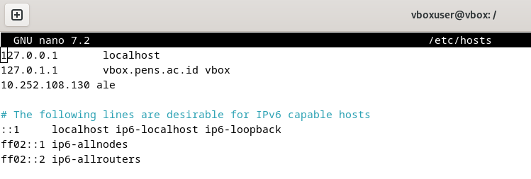

Untuk mengonfigurasi alamat IP dalam file `/etc/hosts` agar komputer dapat mengenali nama host `ale`, ikuti langkah-langkah berikut:

### 1. Buka File `/etc/hosts`

Gunakan editor teks seperti `nano`  dengan hak akses root:

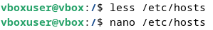

### 2. Tambahkan Entri untuk `ale`

Tambahkan baris berikut, ganti `192.168.1.100` dengan alamat IP komputer yang ingin dikaitkan dengan nama `ale`:

```bash
192.168.1.100    ale
```

### 3. Uji Koneksi dengan `ping`

Setelah konfigurasi selesai, coba ping komputer dengan nama `ale` untuk memastikan konfigurasi berfungsi:

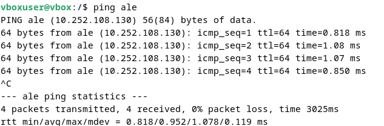

### Cek IP

Gunakan command `ip a` 

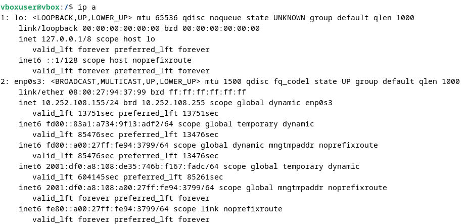

### **resolv**

[]()

Sedangkan isi dari file resolv.conf sendiri bisa dicek menggunakan command

```bash
sudo less /etc/resolv.conf
```

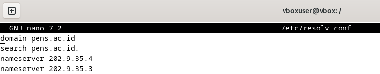

**nameserver** menentukan alamat IP server DNS yang digunakan untuk pencarian domain, dapat berisi lebih dari satu alamat yang dicoba berurutan jika gagal. **search** menetapkan domain yang akan dicari saat hanya sebagian nama host diberikan.

**Test ping www**

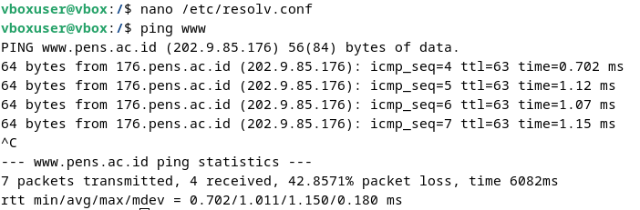

Konfigurasi di `/etc/resolv.conf` memengaruhi resolusi domain melalui dua direktif utama. **search pens.ac.id** memungkinkan sistem menambahkan domain `pens.ac.id` ke nama host yang tidak lengkap, sehingga perintah `ping www` akan otomatis mencoba `ping www.pens.ac.id`. Sementara itu, **nameserver 202.9.85.4** dan **nameserver 202.9.85.3** digunakan jika domain tidak ditemukan secara lokal, di mana sistem akan meminta server DNS tersebut untuk menerjemahkan nama domain ke alamat IP.

### **root.hints**

File `/usr/share/dns/root.hints` berisi daftar server DNS root yang membantu resolver DNS rekursif menemukan server authoritative untuk domain tertentu. File ini biasanya digunakan oleh server DNS lokal seperti BIND, Unbound, atau PowerDNS untuk memulai pencarian domain yang tidak tersedia dalam cache atau zona lokal.


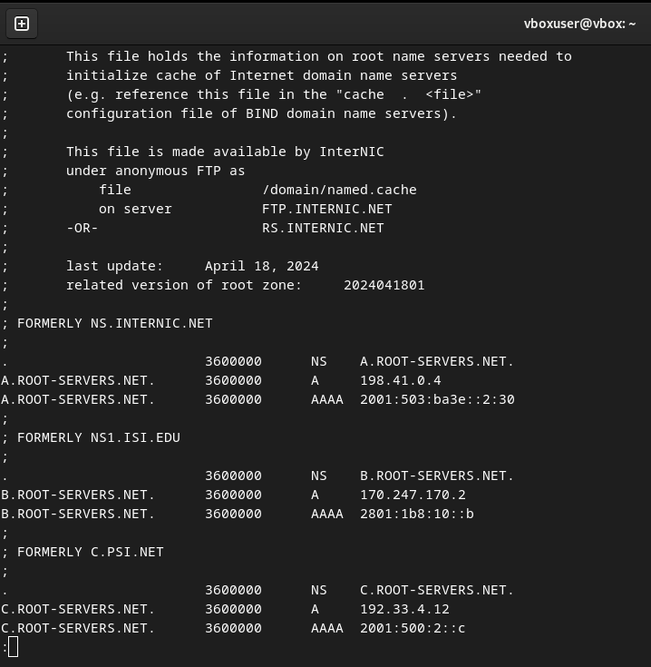

## **Instalasi & Konfigurasi bind9**

### **Konfigurasi Jaringan Internal**

Install bind9

Command untuk install bind9, sebelum itu masuk ke root

```bash
root@dlp:~# apt -y install bind9 bind9utils
```

### **Konfigurasi dan Penyesuaian BIND**

Menambahkan `named.conf.internal-zones`, file konfigurasi baru, ke file utama konfigurasi BIND `/etc/bind/named.conf.`

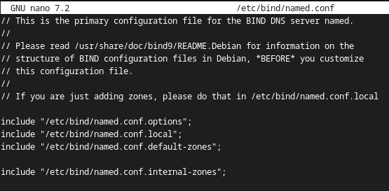

### Konfigurasi pada `/etc/bind/named.conf.options`

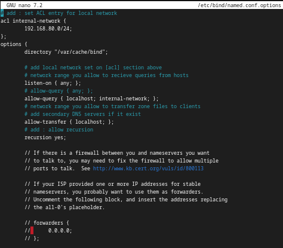

Konfigurasi ACL **internal-network** untuk jaringan `192.168.80.0/24` menentukan siapa yang dapat mengakses layanan DNS, di mana hanya **localhost** dan jaringan internal yang diizinkan melakukan query (`allow-query`), sementara transfer zona hanya diperbolehkan untuk **localhost** (`allow-transfer`). Pencarian rekursif diaktifkan (`recursion yes`) untuk resolusi domain eksternal, validasi DNSSEC diatur otomatis (`dnssec-validation auto`), dan BIND dikonfigurasi agar menerima koneksi IPv6 (`listen-on-v6 { any; }`).

### **Konfigurasi Zona DNS di BIND**

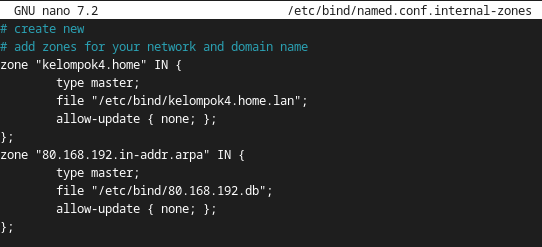

**1. Zona Forward (kelompok4.home)**

Zona ini digunakan untuk menerjemahkan nama domain ke alamat IP dan disimpan dalam file `/etc/bind/kelompok4.home.lan`. Bertindak sebagai **master (utama)**, sehingga server ini menjadi sumber resmi data DNS untuk domain tersebut. Selain itu, update dinamis tidak diizinkan dengan konfigurasi `allow-update { none; };`.

**2. Zona Reverse (80.168.192.in-addr.arpa)**

Zona ini berfungsi untuk menerjemahkan alamat IP ke nama domain (**reverse lookup**) dan disimpan dalam file `/etc/bind/80.168.192.db`. Seperti zona forward, zona ini juga bertindak sebagai **master**, dengan update dinamis yang dinonaktifkan.

### **Konfigurasi opsi BIND untuk menggunakan hanya IPv4 dan menonaktifkan IPv6.**


Untuk mengonfigurasi BIND agar hanya menggunakan IPv4, edit file `/etc/default/named` dan tambahkan opsi `OPTIONS="-u bind -4"`. Opsi ini memastikan BIND berjalan sebagai pengguna `bind` dan hanya menggunakan IPv4, mengabaikan IPv6 untuk menghindari kemungkinan error pada jaringan yang tidak mendukung IPv6.

### **Konfigurasi Zone Files**

Konfigurasi **forward lookup** pada BIND DNS Server untuk jaringan **192.168.80.0/24** dengan domain **kelompok4.home** memungkinkan server menerjemahkan nama domain ke alamat IP dengan menetapkan file zona sebagai **master** dan mendefinisikan pemetaan nama host.

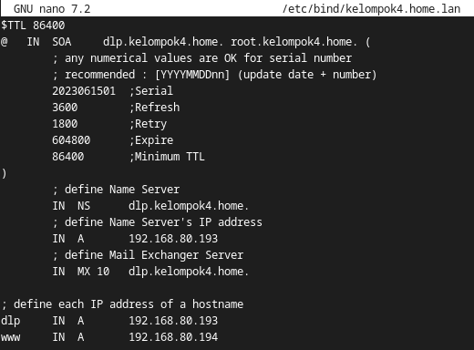

Konfigurasi **reverse lookup** pada BIND DNS Server untuk jaringan **192.168.80.0/24** dengan domain **kelompok4.home** dilakukan dengan membuat file zona `/etc/bind/80.168.192.db`, mendaftarkannya sebagai **master** di `/etc/bind/named.conf.local`, lalu memverifikasi dan merestart BIND agar perubahan diterapkan.

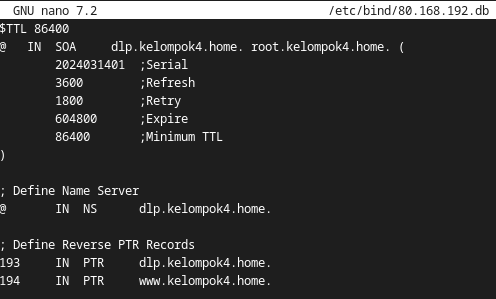

### **BIND: Verify Resolution**

Restart BIND untuk menerapkan perubahan dengan command 

```bash
root@dlp:~# systemctl restart named
```

### **Konfigurasi DNS Client untuk menggunakan DNS Server sendiri**

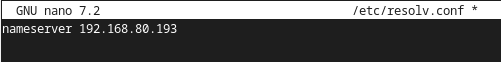

Sistem Linux menggunakan file /etc/resolv.conf untuk memilih DNS server mana yang akan digunakan untuk melakukan query DNS, misalnya menyelesaikan domain ke IP atau sebaliknya.

Dengan mengedit **`/etc/resolv.conf`** dan mengubah **nameserver** menjadi **192.168.80.193**, berarti:

- Mengatur sistem supaya pakai **DNS Server sendiri** (BIND di **192.168.80.193**)
- Prioritaskan pencarian DNS ke **server lokal dulu**, sebelum ke DNS eksternal
- Bikin sistem bisa resolve **domain lokal** yang cuma dikenali oleh DNS internal

### **DNS Query menggunakan DiG (Domain Information Groper) untuk Forward Lookup**


Perintah di atas digunakan untuk menggunakan DNS Server yang telah dikonfigurasi untuk melihat resolusi nama domain ke alamat IP.

### **Reverse DNS Lookup**


Nama domain yang terkait dengan alamat IP tertentu dapat ditemukan dengan menggunakan perintah di atas untuk melakukan pencarian balik.

### Referensi
[Configure for Internal Network](https://www.server-world.info/en/note?os=Debian_12&p=dns&f=1)

[Configure Zone Files](https://www.server-world.info/en/note?os=Debian_12&p=dns&f=3)

[Verify Resolution](https://www.server-world.info/en/note?os=Debian_12&p=dns&f=4)
